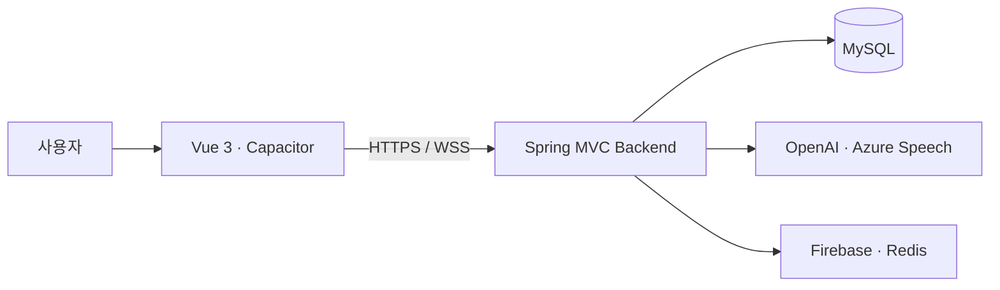
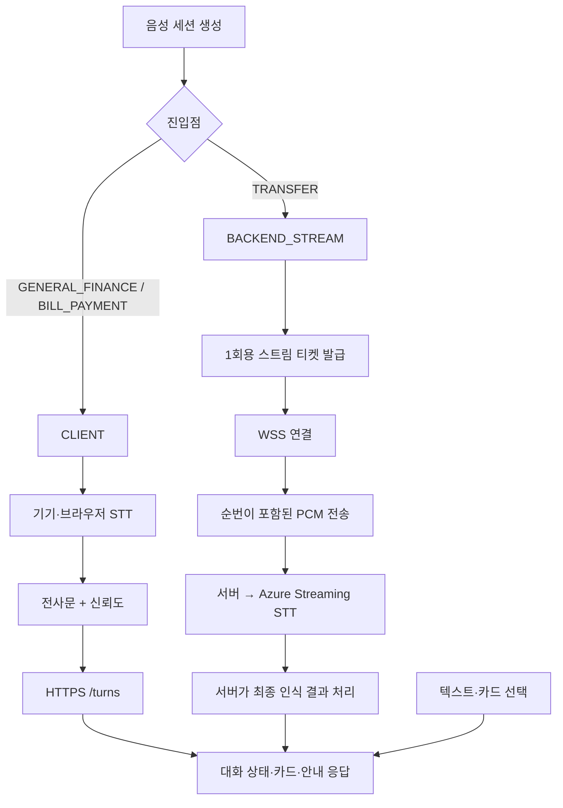
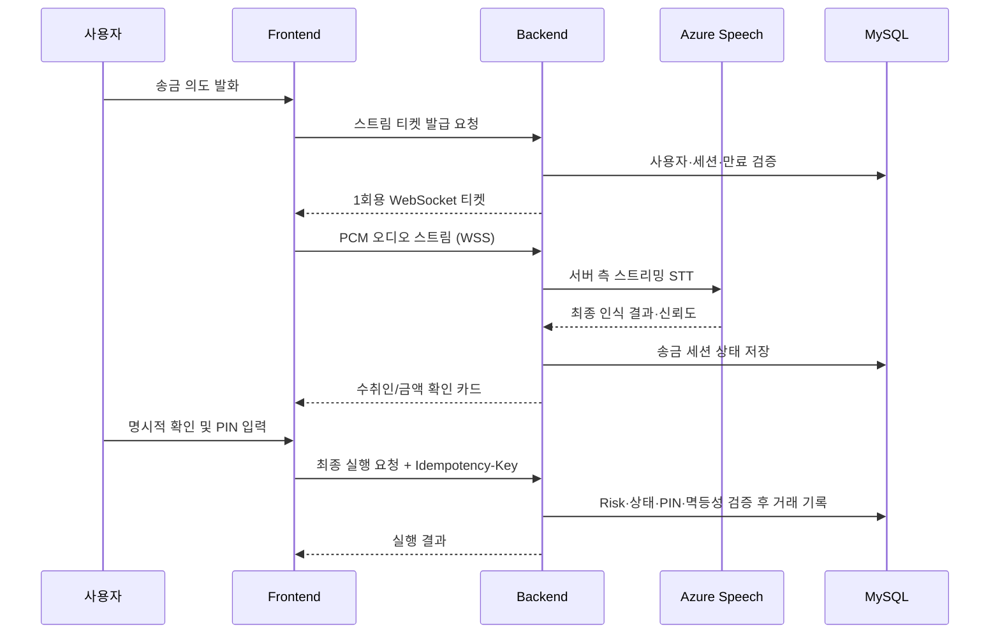

# 귀편한 금융 Backend

> 고령층이 말로 금융 업무를 시작하고, 중요한 순간에는 한 번 더 확인할 수 있도록 설계한 음성 기반 금융 서비스의 백엔드입니다.

`귀편한 금융`은 메뉴 탐색과 작은 글씨, 복잡한 입력에 부담을 느끼는 사용자를 위해 음성·텍스트·카드 선택을 함께 제공합니다. 특히 송금은 음성 인식 결과를 곧바로 실행하지 않고 수취인·금액 확인, 위험 신호 평가, PIN 인증을 거치는 다단계 안전 흐름으로 구성했습니다.

## 서비스 한눈에 보기



| 영역 | 제공 기능 |
| --- | --- |
| 사용자·계좌 | 회원가입/로그인, JWT 인증, 내 정보와 계좌 조회 |
| 음성 금융 | 음성 세션·대화 턴 관리, 입력 경로 분리, 텍스트/카드 대체 입력, 사용자 음성 설정 |
| 안심 송금 | 수취인 후보 선택, 금액 재확인, Risk Score, 보호자 검증, PIN, 멱등 실행 |
| 생활 금융 | 고지서 OCR 분석·납부 흐름, 리마인더 CRUD, 이동점포 조회 |
| 알림·연동 | Redis Streams 기반 알림 파이프라인, Firebase Cloud Messaging, Azure Speech WebSocket |

## 음성 입력 경로

음성 세션을 만들 때 진입점에 따라 `sttMode`를 확정하며, 세션 진행 중에는 입력 경로를 바꾸지 않습니다. 조회·생활 금융처럼 편의성이 중심인 흐름과, 금전 실행으로 이어질 수 있는 송금 흐름을 같은 방식으로 처리하지 않는 구조입니다.

| 구분 | 세션 진입점 / 모드 | 입력 처리 | 서버의 역할 |
| --- | --- | --- | --- |
| 일반 금융·고지서 | `GENERAL_FINANCE`, `BILL_PAYMENT` / `CLIENT` | Capacitor 음성 인식 또는 브라우저 Web Speech API가 전사문과 신뢰도를 만들고, HTTPS `POST /api/voice/sessions/{sessionId}/turns`로 전달 | 대화 턴을 저장하고, 의도·슬롯 분석 및 계좌·고지서·이동점포 응답을 조합해 카드와 안내 문구를 반환 |
| 송금 음성 | `TRANSFER` / `BACKEND_STREAM` | 프런트가 16 kHz·16-bit·모노 PCM 프레임에 순번을 붙여 WSS로 전달 | 스트림 티켓·세션을 검증하고 Azure Speech의 최종 인식 결과를 직접 받아 송금 대화 상태를 진행 |
| 텍스트 대체 입력 | 모든 음성 세션 | 키보드 입력과 카드 선택을 REST로 전달 | 음성 인식이 어려운 경우에도 동일한 대화·송금 확인 절차를 유지 |



- `CLIENT`는 STT 결과를 대화 입력으로 전달하는 경로입니다. 음성 결과가 애매하면 서버가 재질문·재확인을 요청하며, 중요한 금융 실행 권한으로 직접 사용하지 않습니다.
- `BACKEND_STREAM`에서는 송금용 음성 전사문을 프런트가 임의 REST 요청으로 제출해 처리할 수 없습니다. 서버가 Azure Speech의 최종 결과를 받고, 이후의 수취인·금액 확인 흐름으로만 연결합니다.
- 두 경로 모두 서버가 `ttsText`·`ttsSsml`을 응답합니다. 프런트는 단기 Azure Speech 토큰으로 TTS를 재생하고, 사용할 수 없을 때는 브라우저 음성 합성으로 대체합니다.

## 송금 안전 흐름

말 한마디가 즉시 이체로 이어지지 않도록, 음성은 **입력 수단**으로만 사용합니다. 서버가 거래의 권위 있는 상태를 관리하고, 각 단계가 충족된 경우에만 다음 단계로 진행합니다.



- 송금 WebSocket은 `TRANSFER`·`BACKEND_STREAM` 세션에만 열립니다. 스트림 티켓은 사용자·세션에 결합되며, 60초 만료와 1회 사용 규칙으로 재사용을 제한합니다. 티켓 자체는 송금 승인 권한이 아닙니다.
- 오디오 전송은 `START_ACK` 이후에만 시작하고, 프레임 순번·크기와 종료 이후 입력을 서버가 검증합니다. 재연결과 늦게 도착한 STT 결과도 세션 상태로 관리합니다.
- 인식 결과 뒤에도 수취인 후보 선택, 금액 확인, Risk Score, 보호자 확인(필요 시), PIN, confirmation token 및 멱등성 검증을 통과해야 거래가 실행됩니다. 음성이 어려우면 스트림을 정리한 뒤 텍스트·카드 선택으로 같은 확인 절차를 이어갈 수 있습니다.

## 기술 스택

| 구분 | 사용 기술 |
| --- | --- |
| Language | Java 17 |
| Web | Spring Framework 5.3, Spring MVC, Spring Security |
| Data | MyBatis, MySQL, HikariCP |
| Authentication | JWT, OAuth2 Client |
| Real-time Voice | Spring WebSocket, Azure Speech SDK, Capacitor Speech Recognition, Web Speech API |
| AI / External | OpenAI API (음성 대화 분석·고지서 OCR), Firebase Admin SDK, Redis Streams |
| API Docs | Swagger 2 / Springfox |
| Build / Deploy | Gradle, WAR, Tomcat 9, Docker, Railway |
| Test | JUnit 5, Mockito, H2 |

> 이 프로젝트는 Spring Boot 애플리케이션이 아니라 **WAR로 빌드해 Tomcat 9에 배포하는 Spring MVC 애플리케이션**입니다.

## 프로젝트 구조

```text
src
└── main
    ├── java/com/silvertown
    │   ├── global/        # 보안, 예외 처리, Web/Root 설정, 공통 응답
    │   └── domain/
    │       ├── auth/          # 인증·JWT
    │       ├── account/       # 계좌·사용자 정보
    │       ├── recipient/     # 수취인 후보
    │       ├── transfer/      # 송금·PIN·보호자 검증·멱등성
    │       ├── risk/          # 송금 위험 신호 평가
    │       ├── voice/         # 음성 세션·STT 스트리밍·적응형 안내
    │       ├── bill/          # 고지서 OCR·납부
    │       ├── reminder/      # 리마인더
    │       └── mobilebranch/  # 이동점포 조회
    └── resources
        ├── mapper/        # MyBatis SQL Mapper XML
        └── application.properties
```

## 시작하기

### 사전 요구 사항

- JDK 17
- MySQL 8.x
- Tomcat 9.x (로컬 WAR 배포 시)
- 선택: Docker

### 1. 환경 설정

MySQL 데이터베이스를 준비한 뒤, DB 연결 정보와 외부 서비스 설정을 환경에 주입합니다. 로컬 개발에서는 `src/main/resources/application-local.properties`와 `.env`를 사용하고, 배포 환경에서는 플랫폼의 환경 변수를 사용합니다.

| 범주 | 설정 항목 |
| --- | --- |
| DB | URL, 사용자명, 비밀번호 |
| 인증·암호화 | JWT, 계좌정보 암호화 키, 보호자 검증 키 |
| 음성·AI | Azure Speech, OpenAI |
| 알림 | Redis, Firebase |

`.env`, `application-local.properties`, 키·토큰·개인정보는 저장소에 포함하지 않습니다.

### 2. 테스트와 WAR 빌드

```powershell
.\gradlew.bat test
.\gradlew.bat war
```

빌드 결과물은 `build/libs/`에 생성됩니다. 생성된 WAR를 Tomcat의 `webapps/ROOT.war`로 배포한 뒤 서버를 실행합니다.

### 3. API 문서 확인

로컬 Tomcat을 기본 포트로 실행한 경우 Swagger UI에서 API를 확인할 수 있습니다.

```text
http://localhost:8080/swagger-ui.html
```

인증이 필요한 API는 로그인 후 발급받은 JWT를 사용합니다. 세부 요청·응답 계약은 Swagger UI를 기준으로 확인할 수 있습니다.

## Docker 실행

Dockerfile은 Gradle 빌드 단계와 Tomcat 실행 단계를 분리한 multi-stage 구성입니다.

```powershell
docker build -t silvertown-backend .
docker run --rm -p 8080:8080 --env-file .env silvertown-backend
```

배포 환경에서는 환경 변수로 민감한 설정을 주입하며, `.env` 파일을 이미지나 저장소에 포함하지 않습니다.

## 주요 API 영역

| 도메인 | 대표 경로 |
| --- | --- |
| 인증 | `/api/auth/signup`, `/api/auth/login`, `/api/auth/refresh`, `/api/auth/logout` |
| 사용자·계좌 | `/api/users/me`, `/api/accounts` |
| 수취인·송금 | `/api/recipients/candidates`, `/api/transfers/**` |
| 고지서·리마인더 | `/api/bills/**`, `/api/reminders/**` |
| 음성 | `/api/voice/**`, `/api/voice/sessions/{sessionId}/stream` (WSS), `/api/users/me/voice-settings` |
| 이동점포 | `/api/mobile-branches/nearby` |

송금 음성 스트림은 세션별 스트림 티켓을 발급받은 뒤 WebSocket으로 연결합니다. WebSocket 메시지 형식과 보안 정책은 Swagger 대상이 아니므로 소스 구현을 기준으로 확인합니다.

## 테스트

- 컨트롤러·서비스·Mapper·음성 스트림의 단위 및 통합 테스트를 JUnit 5 기반으로 작성합니다.
- 계좌·송금 상태처럼 금전적 결과에 연결되는 로직은 멱등성, 상태 전이, 권한 검증을 우선 확인합니다.

## Backend Team

| 이름 | 역할 |
| --- | --- |
| 한혜지 | 팀장 · AI 음성 엔진 및 실시간 음성 흐름 |
| 정민규 | 인증·생활 금융 기능 및 배포 환경 |
| 배민주 | 계좌 관리 및 안심 송금 흐름 |

---

KB IT's Your Life Hackathon · SilverTown Team
