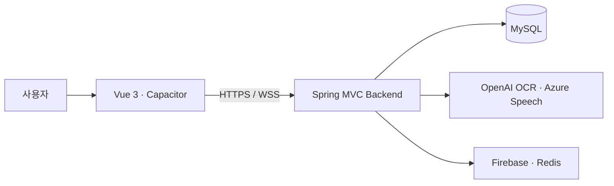
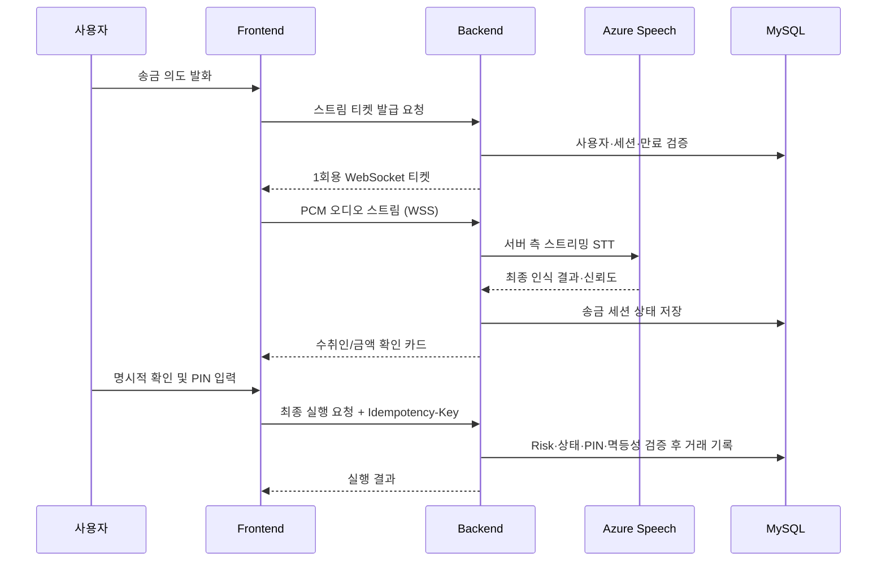

# 귀편한 금융 Backend

> 고령층이 말로 금융 업무를 시작하고, 중요한 순간에는 한 번 더 확인할 수 있도록 설계한 음성 기반 금융 서비스의 백엔드입니다.

`귀편한 금융`은 메뉴 탐색과 작은 글씨, 복잡한 입력에 부담을 느끼는 사용자를 위해 음성·텍스트·카드 선택을 함께 제공합니다. 특히 송금은 음성 인식 결과를 곧바로 실행하지 않고 수취인·금액 확인, 위험 신호 평가, PIN 인증을 거치는 다단계 안전 흐름으로 구성했습니다.

## 서비스 한눈에 보기



| 영역 | 제공 기능 |
| --- | --- |
| 사용자·계좌 | 회원가입/로그인, JWT 인증, 내 정보와 계좌 조회 |
| 음성 금융 | 음성 세션·대화 턴 관리, 텍스트/카드 대체 입력, 사용자 음성 설정 |
| 안심 송금 | 수취인 후보 선택, 금액 재확인, Risk Score, 보호자 검증, PIN, 멱등 실행 |
| 생활 금융 | 고지서 OCR 분석·납부 흐름, 리마인더 CRUD, 이동점포 조회 |
| 알림·연동 | Redis Streams 기반 알림 파이프라인, Firebase Cloud Messaging, Azure Speech WebSocket |

## 송금 안전 흐름

말 한마디가 즉시 이체로 이어지지 않도록, 음성은 **입력 수단**으로만 사용합니다. 서버가 거래의 권위 있는 상태를 관리하고, 각 단계가 충족된 경우에만 다음 단계로 진행합니다.



- 송금 음성은 프런트가 전사문을 신뢰 가능한 금융 입력으로 전달하는 방식이 아니라, 백엔드가 Azure Speech의 최종 결과를 직접 받는 `BACKEND_STREAM` 경로를 사용합니다.
- 스트림 티켓은 사용자·세션에 결합되며, 짧은 만료 시간과 1회 사용 규칙으로 재사용을 제한합니다. 티켓 자체는 송금 승인 권한이 아닙니다.
- 인식 결과 뒤에도 수취인 후보 선택, 금액 확인, Risk Score, 보호자 확인(필요 시), PIN, confirmation token 및 멱등성 검증을 통과해야 거래가 실행됩니다.

## 기술 스택

| 구분 | 사용 기술 |
| --- | --- |
| Language | Java 17 |
| Web | Spring Framework 5.3, Spring MVC, Spring Security |
| Data | MyBatis, MySQL, HikariCP |
| Authentication | JWT, OAuth2 Client |
| Real-time Voice | Spring WebSocket, Azure Speech SDK |
| AI / External | OpenAI API (고지서 OCR 분석), Firebase Admin SDK, Redis Streams |
| API Docs | Swagger 2 / Springfox |
| Build / Deploy | Gradle, WAR, Tomcat 9, Docker, Railway |
| Test | JUnit 5, Mockito, H2 |

> 이 프로젝트는 Spring Boot 애플리케이션이 아니라 **WAR로 빌드해 Tomcat 9에 배포하는 Spring MVC 애플리케이션**입니다.

## 프로젝트 구조

```text
src
└── main
    ├── java/com/silvertown
    │   ├── global/        # 보안, 예외 처리, Web/Root 설정, 공통 응답
    │   ├── auth/          # 인증·JWT
    │   ├── account/       # 계좌·사용자 정보
    │   ├── recipient/     # 수취인 후보
    │   ├── transfer/      # 송금·PIN·보호자 검증·멱등성
    │   ├── risk/          # 송금 위험 신호 평가
    │   ├── voice/         # 음성 세션·STT 스트리밍·적응형 안내
    │   ├── bill/          # 고지서 OCR·납부
    │   ├── reminder/      # 리마인더
    │   └── mobilebranch/  # 이동점포 조회
    └── resources
        ├── mapper/        # MyBatis SQL Mapper XML
        └── application.properties
```

## 시작하기

### 사전 요구 사항

- JDK 17
- MySQL 8.x
- Tomcat 9.x (로컬 WAR 배포 시)
- 선택: Docker

### 1. 데이터베이스 준비

공유된 DDL로 로컬 MySQL 스키마를 생성합니다. 데이터베이스 접속 정보와 외부 서비스 키는 버전 관리되지 않는 `src/main/resources/application-local.properties` 또는 운영 환경 변수로 설정합니다.

필수 설정값은 환경에 따라 다르며, 실제 값은 팀의 보안 채널에서만 관리합니다.

| 범주 | 예시 설정 |
| --- | --- |
| DB | `db.url`, `db.username`, `db.password` |
| 인증·암호화 | `JWT_SECRET`, `ACCOUNT_CRYPTO_KEY`, `GUARDIAN_VERIFICATION_HMAC_SECRET` |
| 음성·AI | Azure Speech key/region, `OPENAI_API_KEY` |
| 알림 | Redis, Firebase 설정 |
| 운영 정책 | 허용 Origin, 위험 차단 목록, 데모용 보호자 설정 |

`.env`, `application-local.properties`, 인증 키·토큰·실제 계좌 데이터는 저장소에 커밋하지 않습니다.

### 2. 테스트와 WAR 빌드

Windows PowerShell 기준입니다.

```powershell
.\gradlew.bat test
.\gradlew.bat war
```

빌드 결과물은 `build/libs/`에 생성됩니다. 생성된 WAR를 Tomcat의 `webapps/ROOT.war`로 배포한 뒤 서버를 실행합니다.

### 3. API 문서 확인

로컬 Tomcat을 기본 포트로 실행한 경우 Swagger UI에서 API를 확인할 수 있습니다.

```text
http://localhost:8080/swagger-ui.html
```

인증이 필요한 API는 먼저 로그인 후 발급받은 JWT를 사용합니다. 실제 요청·응답 계약은 Swagger 및 프런트엔드와 합의한 명세를 기준으로 합니다.

## Docker 실행

Dockerfile은 Gradle 빌드 단계와 Tomcat 실행 단계를 분리한 multi-stage 구성입니다.

```powershell
docker build -t silvertown-backend .
docker run --rm -p 8080:8080 --env-file .env silvertown-backend
```

운영 환경에서는 Railway의 Secret/환경 변수에 민감한 설정을 주입하며, `.env` 파일을 이미지나 저장소에 포함하지 않습니다.

## 주요 API 영역

| 도메인 | 대표 경로 |
| --- | --- |
| 인증 | `/api/auth/signup`, `/api/auth/login`, `/api/auth/refresh`, `/api/auth/logout` |
| 사용자·계좌 | `/api/users/me`, `/api/accounts` |
| 수취인·송금 | `/api/recipients/candidates`, `/api/transfers/**` |
| 고지서·리마인더 | `/api/bills/**`, `/api/reminders/**` |
| 음성 | `/api/voice/**`, `/api/users/me/voice-settings` |
| 이동점포 | `/api/mobile-branches/nearby` |

송금 음성 스트림은 세션별 스트림 티켓을 발급받은 뒤 WebSocket으로 연결합니다. 경로·메시지 형식·보안 정책은 변경될 수 있으므로 구현과 Swagger/팀 API 명세를 함께 확인해야 합니다.

## 테스트 원칙

- 컨트롤러·서비스·Mapper·음성 스트림의 단위 및 통합 테스트를 JUnit 5 기반으로 작성합니다.
- 계좌·송금 상태처럼 금전적 결과에 연결되는 로직은 멱등성, 상태 전이, 권한 검증을 우선 확인합니다.
- 실제 Azure, Firebase, Railway, MySQL을 모두 포함한 운영 환경 E2E는 별도 환경 설정이 필요합니다.

## MVP 범위와 유의 사항

- 송금 실행은 해커톤 MVP의 DB 기반 거래 흐름 검증에 초점을 둡니다. 실제 은행망 이체에는 금융 API 제휴와 추가 인증·감사·보안 요건이 필요합니다.
- 외부 AI·음성 서비스 사용 시 실제 서비스 전환 전 데이터 최소화, 보존 기간, 사용자 동의 및 공급자 계약을 별도로 검토해야 합니다.
- 음성 입력이 어려운 상황을 위해 텍스트 입력과 화면 카드 선택을 함께 제공하는 것을 서비스 원칙으로 둡니다.

## Backend Team

| 이름 | 역할 |
| --- | --- |
| 한혜지 | 팀장 · AI 음성 엔진 및 실시간 음성 흐름 |
| 정민규 | 인증·생활 금융 기능 및 배포 환경 |
| 배민주 | 계좌 관리 및 안심 송금 흐름 |

---

KB IT's Your Life Hackathon · SilverTown Team
